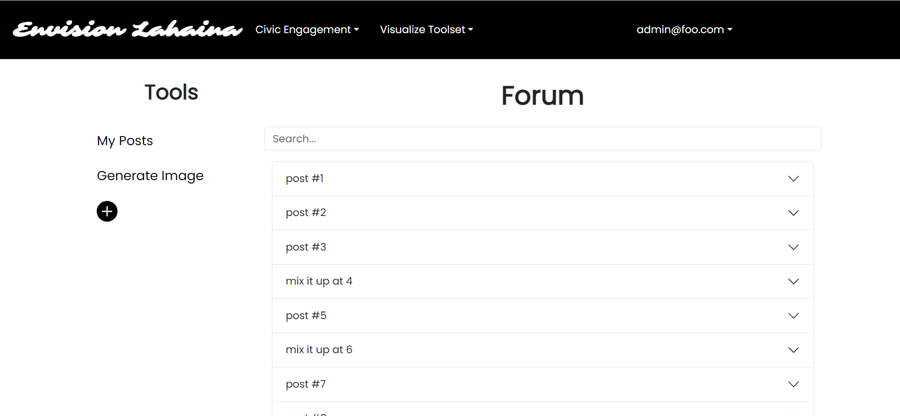

## Outline
- Survey
- Forum
- Collaborative Platform
- Generative AI (Image AI)
- GIS and Mapping Features

## Implementation
1. Mapping software (GIS)
2. Map Modeling tools, art sketching for 2d concepts (AI image/model
   generation for prototyping buildings, landscape)
4. Community Engagement (discussion forums linked to models, surveys)
5. Economic and Environmental Analysis Tools
6. Online and in-person shared digital spaces

## Contract link
Google Doc: https://docs.google.com/document/d/1OkHVLfvYzdDmIIxS3qWZuMIPUi7U8FvqCDTSmxmRDzE/edit?usp=sharing

## Organization Link
https://github.com/envision-lahaina

## Deployed Applicaion

https://envisionlahaina.com/

## M1 Issues

https://github.com/orgs/envision-lahaina/projects/1

## M2 Issues

https://github.com/orgs/envision-lahaina/projects/2

## M3 Issues

https://github.com/orgs/envision-lahaina/projects/5

## Page Overview

We want to create a web portal that facilitates the civic engagement around how to rebuild Lahaina, Maui, including surveys, forums, sharing design concepts with visual and data models for economic, environmental, etc. analysis.

## Landing Page

The landing page for any new visitors or user who have not logged in yet. Vistior have options to sign up or sign in.

## Home Page

The Home Page is the first page that users will see when they Login, no other feature will be accessible unless user is signed in

## Civic Engagement

#### Forum

Forum consists of posting, commenting, searching base on titles, and viewing your own post by click on my posts.

#### Survey

Survey page allows creating, voting and searching for an specific surveys base on contents. User are limited to voting once per survey to ensure fair and accurate results.

#### Community

User have an option to add, edit or delete their profile. This is a page demonstrating profiles of all users who choose to add one.

### Visualize Toolset

#### Map-Modeling

Collaborative Platform allowing user to add their design concept. Ping or search any location to view other or add your own design concepts!

#### Generative-AI

Generative AI powered by Dall-E3, user give a prompt regarding their design or to envision Lahaina, then it will return a Image generated by AI in seconds. User also guaranteed 100% right to image generated.

#### Gis Map

Embeded Gis Map with data visualization and 360 VR of scenes in Lahaina.

#### External

Exteral Resources for user to learn more about Lahaina and access useful resources.

## Additional Feature

- Sign-in/up/out
- Add/Edit/Delete Profile
- Text moderation 24/7 hours, admin-free

### Developer Guide

Replace all 'YOUR-KEY' field with your own api key.

- Meteor npm install(Install needed packages for the first time)

- Meteor npm run start (To start the app)

